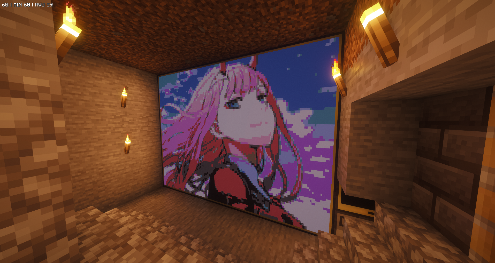
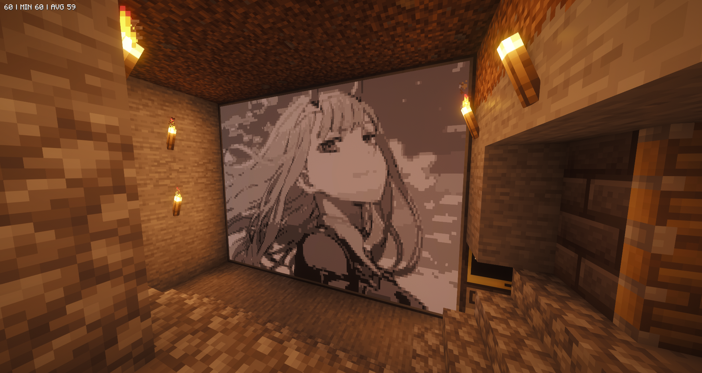
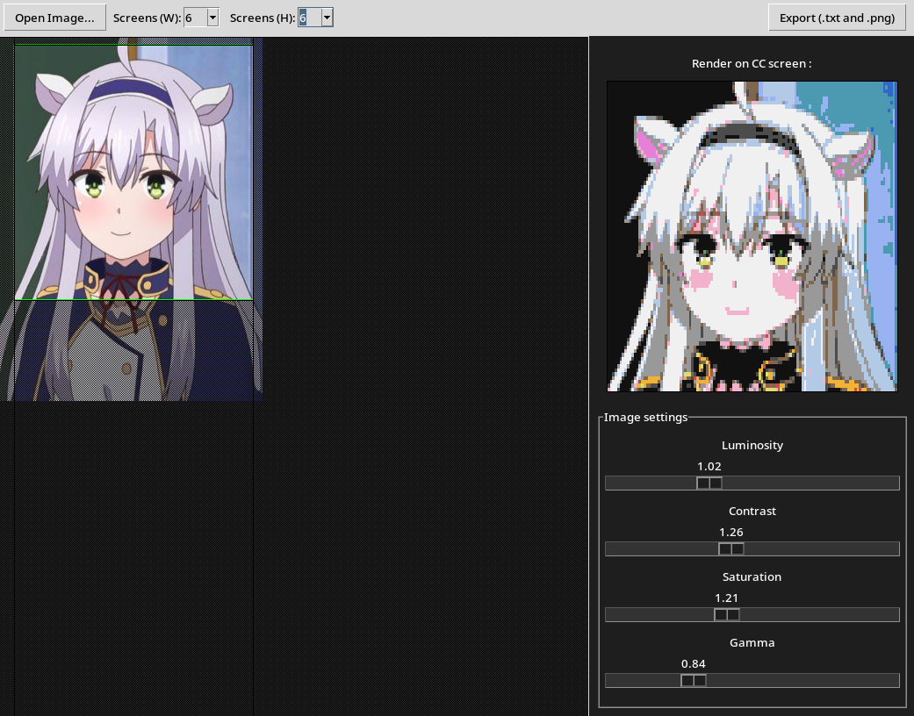
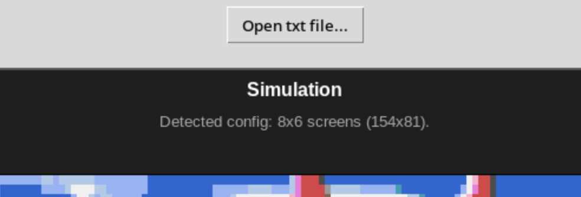

# CC:Tweaked ImageSync

A tool to convert real-world images and display them flawlessly on CC:Tweaked in Minecraft. 

<p align="center">
  
</p>

ComputerCraft "empty" characters can be used as "pixels", but these characters have a 5x8 aspect ratio. If you simply resize an image to the monitor's character resolution, it will appear horribly stretched in-game.

Therefore, this script calculates the true physical aspect ratio, pre-distorting the image, mapping it to the 16-color CC:Tweaked palette. So everything's good !


## Getting started

### Prerequisites

* **Python > 3.11** for native tomllib support *(tested on 3.14.4 but any version that has pillow should work)*
* **Pillow** for image processing.
* **Tkinter** for GUI.
* Minecraft with CC:Tweaked mod.
* Advanced Computers and Advanced Monitors 
* HTTP API enabled in CC:Tweaked server config (enabled by default).

> [!CAUTION]
> Standard grey monitors do not support color. Since 1.80pr1 they can use all 16 colors but will render in grayscale on screen. More information [here](https://tweaked.cc/peripheral/monitor.html#v:blit)
<p align="center">
  
</p>


### Installation

1. Clone this repository:
```bash
git clone https://github.com/stupid-neko/CCTweaked-ImageSync.git
cd CCTweaked-ImageSync
```

2. Create a virtual environment (optional but recommended) and install dependencies aka pillow:
```bash
python3 -m venv .venv
source .venv/bin/activate  # (or .fish), on Windows use: .venv\Scripts\activate
pip install -r requirements.txt
```

> [!WARNING]
> On Linux you may need to install tkinter using `sudo apt install python3-tk` or `sudo pacman -S tk`


## How to Use

### Generate the Data (Python)
Run the main interface:
```bash
python3 main.py
```
1. Click Open Image and select your picture
2. Set your monitor grid size
3. Use your mouse to drag the crop area and the scroll wheel to zoom
4. Adjust the Brightness, Contrast, Saturation, and Gamma sliders to make the preview look as good as possible in 16 colors.
5. Click Export as... and save your .txt file (it will default to the outputs/ folder).

<p align="center">
  
</p>

### Host the Data
Because CC computers need a way to download the image data, Pastebin is used.

1. Open the generated .txt file from the outputs/ folder and copy all the text.
2. Go to [Pastebin](https://pastebin.com/), paste the text, and create a new paste.
3. Copy the ID from the end of the Pastebin URL (for https://pastebin.com/aBcD123, the ID is aBcD123).

### Display in Minecraft (Lua)
Download the Lua script to your CC computer with pastebin. I published the most up to date version to pastebin [here](https://pastebin.com/x0JWn6b2), and I recommend you to do so (or use mine). Then type:
```
pastebin get [your code or "x0JWn6b2"] imagesync.lua
``` 

Then run the script with the Pastebin ID you copied
```plaintext
> imagesync pmF7EYpT
```

### See the text files
If for any reason you want to see a text file you made long time ago, you can use `viewer.py`. You will also be able to see the rendered image, and if you forgot its width/height, this script will tell it to you :D

<p align="center">
  
</p>

### Custom palettes
Starting from v1.80pr1, `setPaletteColor(...)` can change the rgb value for a color, allowing more complex images. You can change the palette directly in the `config.toml` file.


## To do if im not lazy
- [ ] No other ideas :c
- [x] ~~Lua: Download and save image so they are not downloaded each time~~
- [x] ~~Recognition of a txt file dimensions~~


## Contributing
Idk it's my 1st project, fork this project if you want I'll consider adding things here.


## Author
Made by Spider Neko and Gemini for tricky parts, and created for ComputerCraft / CC:Tweaked.

<p align="center">
  
</p>

Love ya <3
